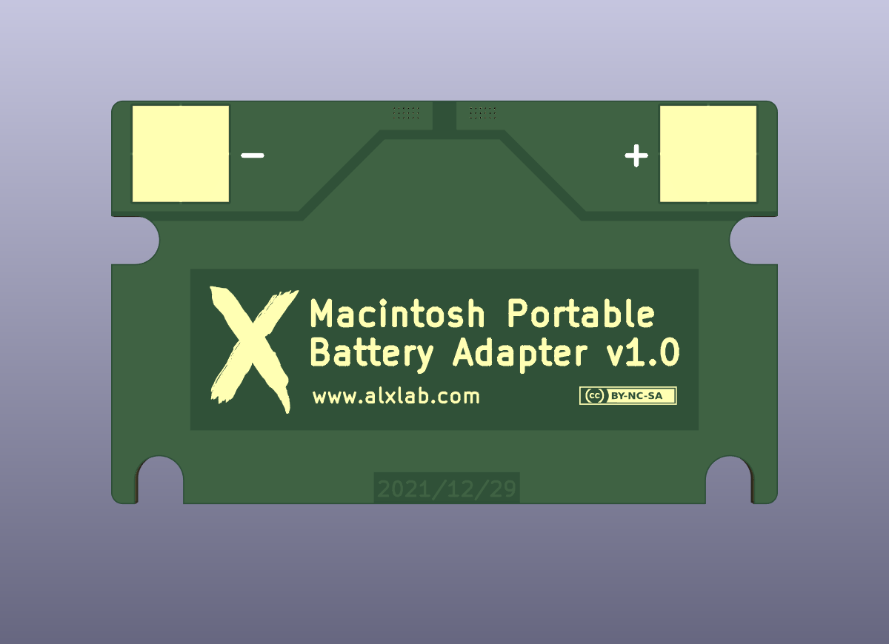
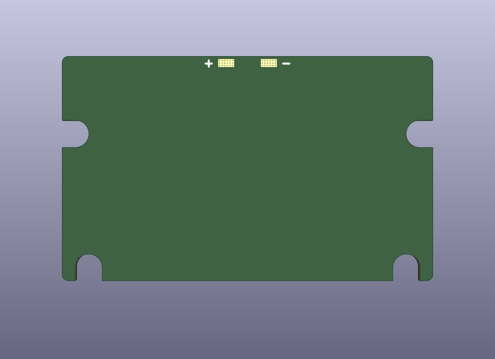
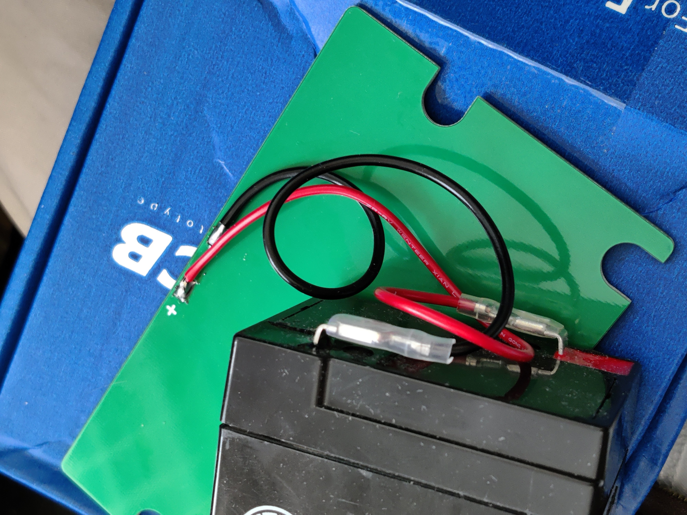
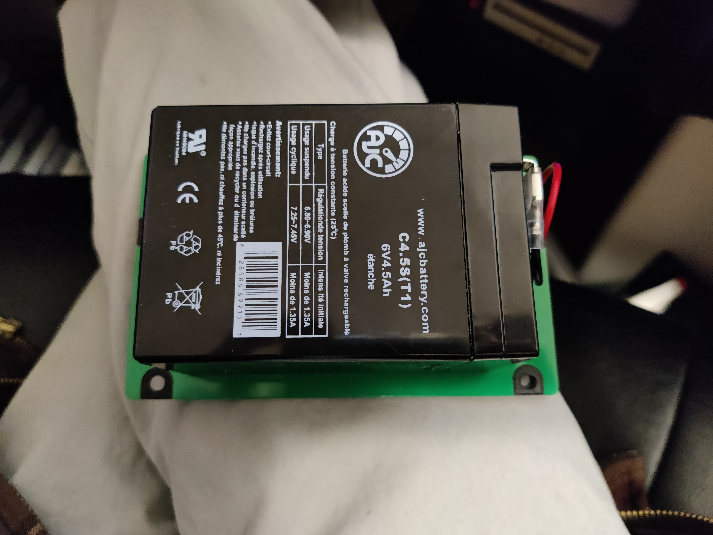
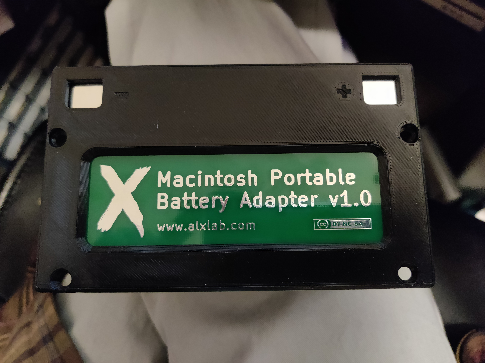
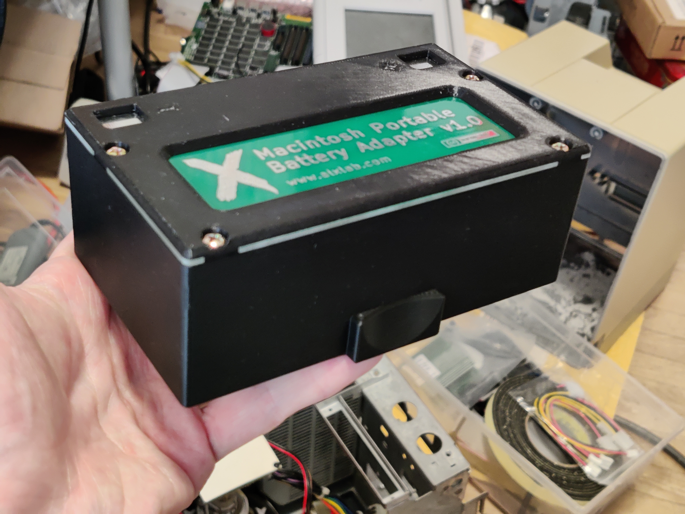

# Macintosh Portable Battery Adapter

This project was created to allow current rectangular 6v lead-acid batteries with spade terminals to be used as a Macintosh Portable battery in a cost effective manner. This is achieved with a spacer made of plastic or cardboard and PCB for the battery contacts. The lead-acid battery is then connected to the PCB via wires with female spade connectors. 

The spacer and PCB is sufficient and the cheapest way to use a 6V lead-acid battery in the portable. This is useful for testing since the battery can be easily swapped. 

There's also a cover that can be 3D printed to give the battery a complete case. Padding should be added to keep the battery from moving around inside the case.

The case is a modified version of the [Macintosh Battery Enclosure 3D model](https://www.thingiverse.com/thing:5185715) done by Stephen Arsenault. Thanks!

## 3D Printing Notes

This can be printed without supports. If you're using a FDM printer with a 0.4mm nozzle like I am, then I would recommend printing with at least 3 outer/shell layers to give more strength to the screw holes. 

## Bill of Materials

| Quantity | Product Number                                               |
| :------- | ------------------------------------------------------------ |
| 4        | 6-32 3/8" pan head screws. The same used for 3 1/2" hard drives. (Optional. Only need when using complete battery case) |
| 1        | Red stranded wire, 4 AWG, 20cm for positive terminal         |
| 1        | Black stranded wire, 4 AWG, 20cm for negative terminal       |
| 2        | 4.8mm female spade terminal, crimp type                      |

## Pictures

## License

Macintosh Portable Battery Adapter by [Alexandre Marcoux](https://github.com/alxlab-zone66x/Macintosh_Portable_Battery_Adapter) licensed under a <a rel="license" href="http://creativecommons.org/licenses/by-nc-sa/4.0/">Creative Commons Attribution-NonCommercial-ShareAlike 4.0 International License</a>.

## Community

For more great retro hardware projects and a great community check out:

Join us in #skunkworks on [Discord](https://discord.gg/GKcvtgU7P9) to help make retro solutions available to all.

## Attribution

Macintosh Portable Battery Enclosure (M5137) by [StephenLulz](https://www.thingiverse.com/StephenLulz) is licensed under the [Creative Commons Attribution 4.0 International License](http://creativecommons.org/licenses/by/4.0/).
